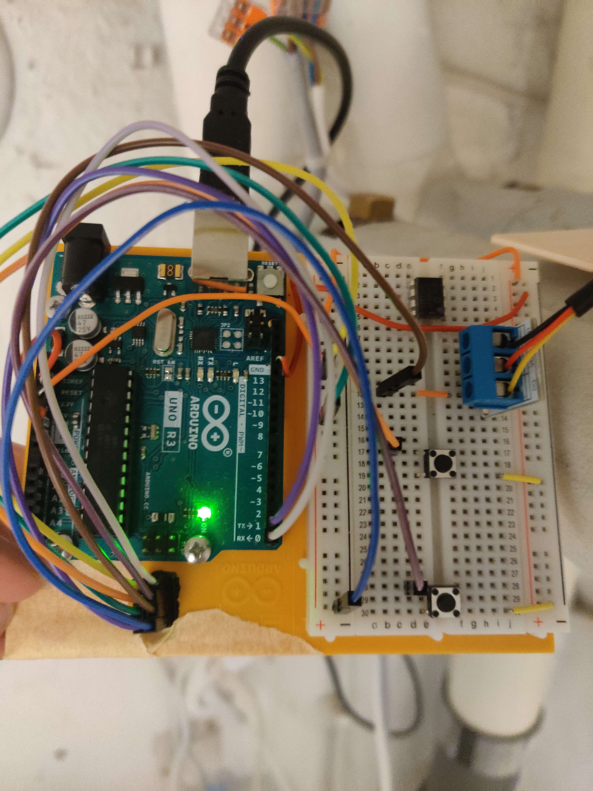

<h1 align="center" id="top">Azure IoT Hub Demo with ESP8266</h1>

## Table of contents
- [About the project](#about-the-project)
    - [Resources used](#resources-used)
- [Overview](#overview)
- [Instructions](#instructions)
    - [Wiring](#wiring)
    - [Installation](#installation)
    - [Setup](#setup)
- [Troubleshooting](#troubleshooting)
- [Recommendations](#recommendations)
- [License](#license)

## About the project
This project demonstrates how to use an ESP8266 microcontroller to connect to Azure IoT Hub, Cosmos DB, and Power BI. The ESP8266 collects data from a DS18B20 temperature sensor and sends it to Azure IoT Hub, where it is stored in Cosmos DB and visualized in Power BI.


### Resources used
- ESP8266 microcontroller
- DS18B20 Temperature sensor
- Azure IoT Hub, Cosmos DB, and Power BI services

<p align="right">(<a href="#top">back to top</a>)</p>

## Overview
```
                                       +------------+
                                       |  DS18B20   |
                                       |  Sensor    |
                                       +------+-----+
                                              |
                                              |
                                              |
                                       +------v-----+
                                       | ESP8266     |
                                       |   MCU       |
                                       +------+-----+
                                              |
                                              |
                                              |
                                       +------v-----+
                                       | Azure IoT  |
                                       |   Hub      |
                                       +------+-----+
                                              |
                                              |
                                              |
                  +------v-----+       +------v-----+
                  | SMHI       |       | Cosmos DB  |
                  | Weather    |       | Warm path  |
                  +------+-----+       +------+-----+
                         |                    |
                         |                    |
                         |                    |
                  +------v-----+       +------v-----+
                  | CSV File   |       | Power Bi   |
                  | Cold path  |------->            |
                  +------+-----+       +------+-----+
```
The goal of this project is to demonstrate how to connect an ESP8266 microcontroller to Azure cloud services for data storage and visualization. The ESP8266 will collect temperature data from a sensor and send it to Azure IoT Hub, which will then store the data in Azure Cosmos DB. From there, the data can be accessed and visualized using Power BI, for reference SMHI weather data from the closest station to the sensor is stored in the Power BI database so comparisons can be made.

<p align="right">(<a href="#top">back to top</a>)</p>

## Instructions
### Wiring
This depends on what version of ESP8266 and DS18b20 you have, for ESP8266-1 and "DS18b20 outside" it was:
```
+-------------------+
|DS18b20  |  ESP8266|
|-------------------|
|   VCC  ---  3,3v  |
|   GND  ---  GND   |
|    S   ---  GPIO2 |
+-------------------+
```
I used an Arduino for power and flashing.
<br>


### Installation
1. Install the latest version of the Arduino IDE on your computer.
2. Install the ESP8266 board package in the Arduino IDE by following the instructions [here](https://github.com/esp8266/Arduino#installing-with-boards-manager).
3. Install the [Azure SDK for C](https://github.com/Azure/azure-sdk-for-c-arduino) library in the Arduino IDE library manager.
4. Install [DallasTemperature](https://github.com/milesburton/Arduino-Temperature-Control-Library) library and its dependencies in the Arduino IDE library manager.

### Setup
1. Create an Azure IoT Hub and an Azure Cosmos DB instance.
2. In the Arduino IDE, open the `Azure_IoT_Hub_ESP8266` example sketch and update your connection info in the iot_configs.h file.
```
// Wifi
#define IOT_CONFIG_WIFI_SSID "SSID"
#define IOT_CONFIG_WIFI_PASSWORD "PWD"

// Azure IoT
#define IOT_CONFIG_IOTHUB_FQDN "[your Azure IoT host name].azure-devices.net"
#define IOT_CONFIG_DEVICE_ID "Device ID"
#define IOT_CONFIG_DEVICE_KEY "Device Key"
```
3. Update the `getTelemetryPayload()` function with the specific data you want to send to Azure IoT Hub and Azure Cosmos DB.
4. Create a Message routing under the IoT Hub to forward the data to Cosmos DB.
5. Login your Azure account in Power BI to connect to Cosmos DB.

<p align="right">(<a href="#top">back to top</a>)</p>

## Troubleshooting
If you get problems storing the data in Cosmos DB you may have to add the following to the top of `sendTelemetry()`
```
uint8_t property_buffer[64];
az_span property_span = AZ_SPAN_FROM_BUFFER(property_buffer);

az_iot_message_properties props;
az_iot_message_properties_init(&props, property_span, 0);

az_iot_message_properties_append(
&props, AZ_SPAN_FROM_STR(AZ_IOT_MESSAGE_PROPERTIES_CONTENT_TYPE), AZ_SPAN_LITERAL_FROM_STR("application%2Fjson"));
az_iot_message_properties_append(
&props, AZ_SPAN_FROM_STR(AZ_IOT_MESSAGE_PROPERTIES_CONTENT_ENCODING), AZ_SPAN_LITERAL_FROM_STR("utf-8"));
```
This will make sure the data is not stored as Base64 but instead JSON utf-8.

<p align="right">(<a href="#top">back to top</a>)</p>

## Recommendations
If this was for production use I would recommend the usage of Azure Key Vault, certificates, HSM and Device Provisioning for scalability and higher security. Then any config files containing keys, passwords and so on do not need to be flashed to the firmware and are not uploaded to any repo. In my example I have added my config file to .gitignore.

It would also be possible to store the SMHI data in the Cosmos database by creating an Azure function that pulls the data from their API on an interval, this function could receive the api as a parameter so the same function can be used for different APIs as this would make it easier to scale up the project. If this method is used it would also allow for and easy path to create a long term Cold path storage solution that would include the sensor data and SMHI data, the Warm data in the database could for example have a TTL (Time To Live) set to 30 days while it would still be possible to access all the old data from the Cold path.

<p align="right">(<a href="#top">back to top</a>)</p>

## License
The SDK and Example used is under MIT license.

<p align="right">(<a href="#top">back to top</a>)</p>